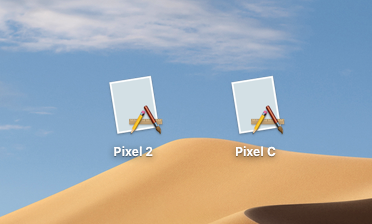

# Android Emulator Standalone

A simple script to generate standalone macOS apps from existing Android Emulator AVDs.

[](https://travis-ci.org/znerol/android-emulator-standalone)

```
Usage: build-app.sh AVD_NAME [ANDROID_SDK_ROOT]
```

The `build-app.sh` script will prepare a directory, copy the AVD and download the necessary SDK components. If the `AVD_NAME` is something like `Pixel_2_API_29`, then the script will create a directory with the name `Pixel 2 API 29.XXXXXX` (where `X` signifies a random character). After the script finishes, the directory can be renamed into `Pixel 2 API 29.app`.

The app bundle then can be distributed to machines without having to install Android Studio or Java.



Whenever the app is first started, the embedded AVD will be copied over to `~/Library/Application Support/Android Emulator Standalone AVD`.

## Caveats

* Use `x86_64` variants of system images. 32bit versions do not seem to work.

* This script calls into `sdkmanager` command line and thus requires Java. It is recommended to set `JAVA_HOME` environment variable to the JRE shipping with Android Studio.

  ```
  export JAVA_HOME=/Applications/Android\ Studio/Contents/jre/jdk/Contents/Home
  ```

* Produced bundles can become several GB in size.

## License

This Software is licensed under the terms of MIT license.
